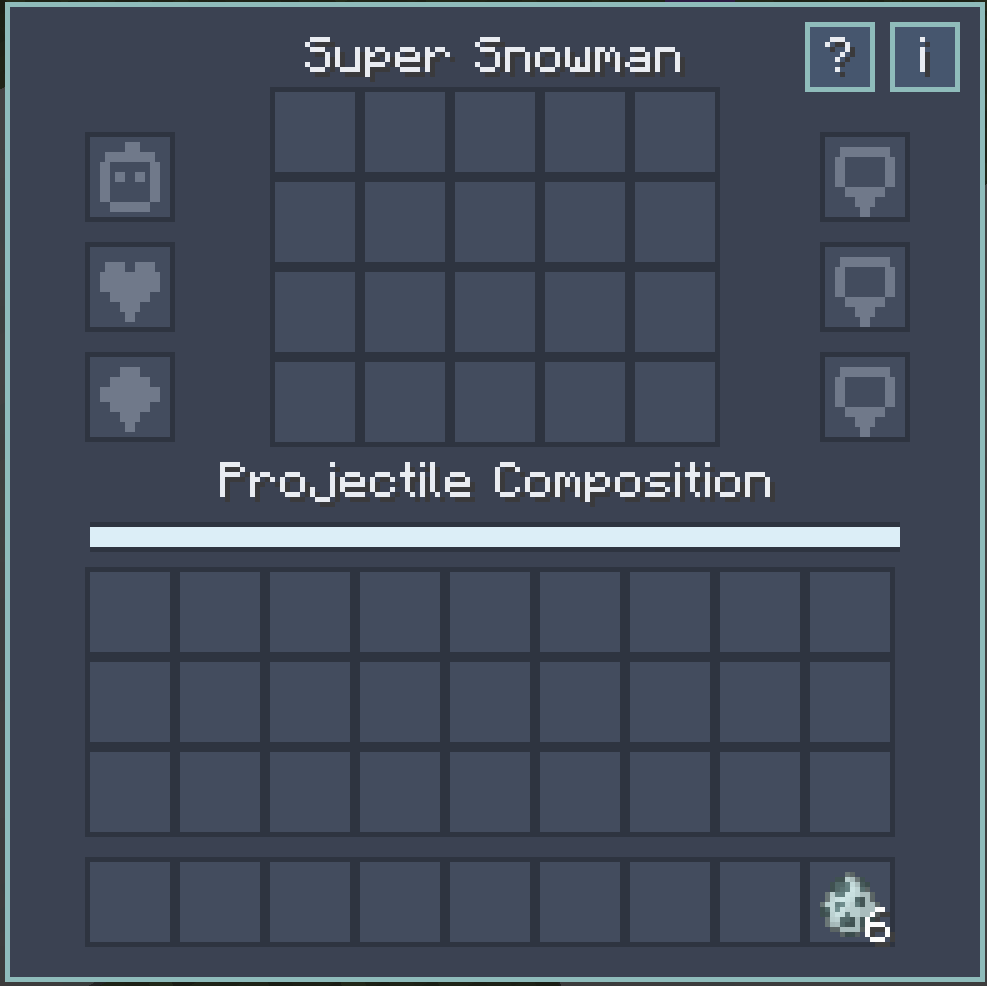
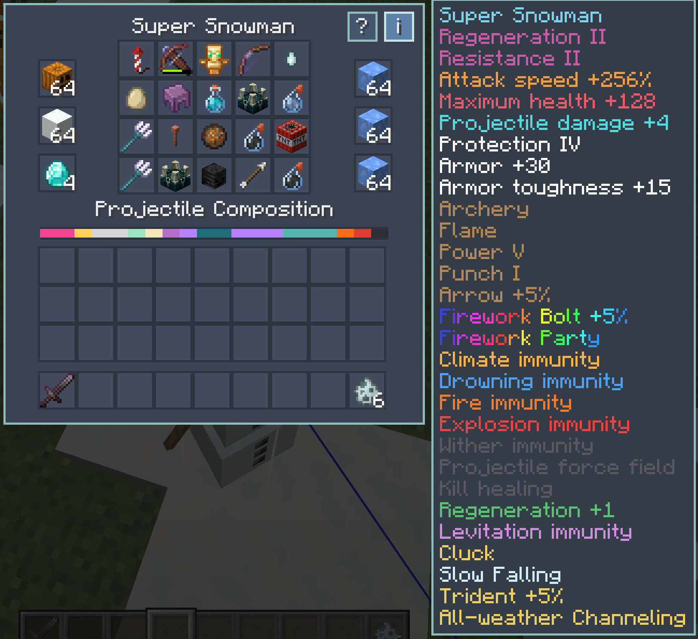
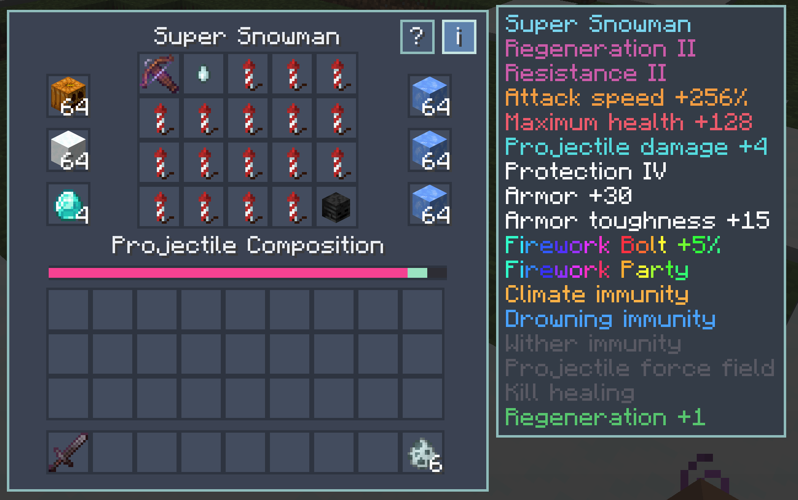
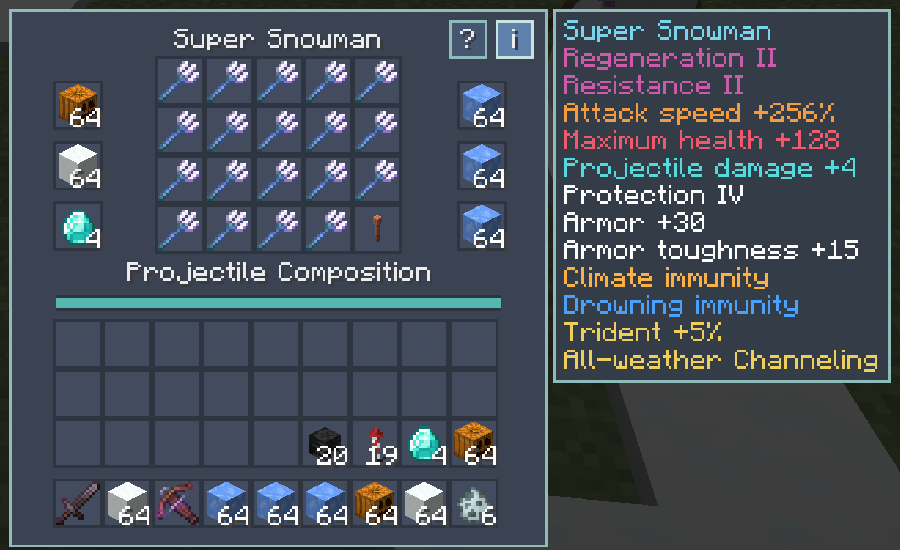

# Super Snowmen

[简体中文](README_zh.md) | English

~~***Snow Superman***~~

Super Snowmen turns ordinary (useless) Minecraft snow golems into configurable ~~superman~~ combat companions.

Open a dedicated upgrade inventory, improve their core attributes, and fill 20 plugin slots with vanilla items to replace snowballs with arrows, fireballs, potions, TNT, sonic booms, and more.

Plugins can also grant passive defenses and combine into stronger synergies.

## Compatibility

| Mod version | Minecraft | Loader | Java | Version-specific content |
| --- | --- | --- | --- | --- |
| 1.0.0 | 1.20.1 | Forge 47.4.10 | 17 | - |
| 1.0.0 | 1.21.1 | NeoForge 21.1.235 | 21 | Wind Charge plugin |

- Side: client and server. Install the mod on both sides for multiplayer.
- Dependencies: no additional mods are required.
- Mod ID: `super_snowmen`
- Issues: [GitHub issue tracker](https://github.com/LostPatrol/SuperSnowmen/issues)

## Use

1. Build a vanilla snow golem, then right-click it to open the upgrade screen.
2. Place valid items in the three base slots, 20 projectile-plugin slots, and three special slots. Click the `?` button for the plugin guide and the `i` button for the current effects.
3. Shift-right-click the snow golem to withdraw every installed item. Items that do not fit in your inventory are dropped safely.
4. Right-click a damaged snow golem with a snowball to restore 10 health. One snowball is consumed unless the player is in Creative mode; nothing is consumed at full health.

Upgrades drops when the golem dies. Snow-golem-owned attacks do not damage players or other snow golems, including explosions, harmful potion effects, and Channeling lightning.

## Upgrade screen and probability

The center grid contains 20 plugin slots, and every slot represents one of 20 equally likely outcomes. A normal plugin occupies one outcome, so one installed plugin gives a 5% replacement chance. Empty slots remain snowball outcomes. Duplicate plugins increase that projectile's share in 5% steps, except Bow, Crossbow, and Lightning Rod, which are limited to one each.

The composition bar shows the real outcome distribution after synergies are resolved. Plugin slots hold one item each. Whether a selected item is consumed is controlled by the server configuration described below.

## Base upgrades

| Item | Slot limit | Effect |
| --- | ---: | --- |
|  Pumpkin or Carved Pumpkin | 64 | Each pumpkin adds 4% attack speed. |
|  Snow Block | 64 | Each block adds 2 maximum health. |
|  Diamond | 4 | Each diamond adds 1 raw outgoing damage and one Protection-equivalent point of damage reduction. |

## Special upgrades

Each of the three special slots activates only when it contains a full stack of 64. The slots are calculated independently, so armor and toughness stack even when the same type of ice is used more than once.

| Item | Effect per full stack |
| --- | --- |
|  Ice | Climate immunity and +5 armor. Climate immunity prevents environmental heat damage, but does not grant fire resistance. |
|  Packed Ice | Climate immunity, drowning immunity, and +10 armor. |
|  Blue Ice | Climate immunity, drowning immunity, +15 armor, and +5 armor toughness. |

Minecraft's normal effective-armor cap still applies. This mod can be used alongside other mods that remove the armor cap.

## Projectile plugins

| Plugin | Projectile and passive effects |
| --- | --- |
|  **Arrow** | Fires a vanilla arrow. |
|  **Spectral Arrow** | Fires a spectral arrow. |
|  **Fire Charge** | Fires a small fireball and continuously grants Fire Resistance I while installed. |
|  **Ghast Tear** | Fires a large fireball that cannot break blocks. Also raises the snow golem's current Regeneration effect by one level; multiple Ghast Tears do not stack. |
|  **Firework Rocket** | Fires a firework bolt with three explosion entries and randomized shapes, colors, and special effects. |
|  **Dragon's Breath** | Fires a dragon-breath projectile and grants immunity to dragon-breath damage. |
|  **TNT** | Fires TNT that cannot break blocks and grants immunity to normal explosion damage. |
|  **Wither Skeleton Skull** | Fires a wither skull and grants immunity to Wither. Wither duration follows the vanilla difficulty rules. Kills restore 5 health. Below half health, the snow golem gains a Wither-like force field that makes it immune to projectiles. |
|  **Sculk Shrieker** | Emits a guaranteed-hit sonic shriek that deals a fixed 10 damage, bypasses armor and Protection, and damages other monsters along its path. |
|  **Totem of Undying** | Casts a line of evoker fangs. |
|  **Any Tipped Arrow** | Fires a tipped arrow. |
|  **Any Regular Potion** | The snow golem drinks the potion and receives its effects. |
|  **Any Splash Potion** | Throws a splash potion that does not affect players. |
|  **Any Lingering Potion** | Throws a lingering potion and creates an effect cloud that does not affect players. |
|  **Egg** | Throws eggs, continuously grants Slow Falling, and makes the snow golem lay eggs like a chicken. |
|  **Trident** | Throws a trident; preserves Impaling and Channeling while removing Loyalty and Riptide. |
|  **Shulker Shell** | Fires a shulker bullet, grants +20 armor without stacking, and grants immunity to Levitation. |
|  **Lightning Rod** | Synergy plugin; only one may be installed. It provides no projectile chance by itself. When any Trident is installed, it adds a 5% Trident chance and allows Channeling to trigger regardless of weather. |
|  **Bow** | Synergy plugin; only one may be installed. Adds an extra 5% Arrow chance, reduces arrow projectile spread, gives regular, spectral, and tipped arrows full-draw speed, and applies Power, Punch, and Flame. Does not lose durability. |
|  **Crossbow** | Synergy plugin; only one may be installed. It provides no projectile chance by itself. When a Firework Rocket is installed, it adds a 5% Firework Bolt chance. Multishot fires three matching rockets at once while consuming at most one selected rocket. Does not lose durability. |
|  **Wind Charge** | Fires a wind charge toward the target *(Minecraft 1.21.1 only)*. |

### Set bonuses

- Filling all 20 plugin slots grants Regeneration I and Resistance I continuously.
- Filling all 20 plugin slots **and** activating all six attribute slots upgrades both effects to level II. The three base slots must be nonempty, and every special slot must contain a full valid stack.
- A Ghast Tear increases an existing Regeneration effect by one level.

## Other rules

- **Friendly-fire protection:** attacks owned by a snow golem cannot harm players or other snow golems. Explosions do not knock them back, and harmful effects are not applied to allied snow golems.
- **Invulnerability frames:** a configuration option determines whether snow-golem projectile attacks ignore enemy invulnerability frames. It does not affect lingering-potion clouds or dragon-breath mist.

## Server configuration

The server config is stored per world in `serverconfig/super_snowmen-server.toml`. It can also be changed with in-game commands.

| Key | Default | Effect |
| --- | :---: | --- |
| `enableUpgrades` | `true` | Enables the upgrade GUI, withdrawal/snowball-healing interactions, and projectile replacement. Disabling it does not remove installed upgrades; their passive attributes and effects remain active until the items are removed. |
| `consumeProjectileItems` | `false` | Controls whether upgrade plugins are consumed. When `true`, potion items are also consumed even if the potion-specific option is disabled. |
| `consumePotionProjectiles` | `true` | Additionally controls consumption of Tipped Arrows and regular, splash, and lingering Potions. |
| `bypassDamageCooldown` | `true` | Allows snow-golem attacks to bypass the vanilla damage cooldown of non-player targets. |

## Commands

All commands require permission level 2 and accept `true` or `false`.

| Command | Purpose |
| --- | --- |
| `/supersnowmen enable <boolean>` | Sets `enableUpgrades`. |
| `/supersnowmen consumeProjectiles <boolean>` | Sets `consumeProjectileItems`. |
| `/supersnowmen consumePotionProjectiles <boolean>` | Sets `consumePotionProjectiles`. |
| `/supersnowmen bypassDamageCooldown <boolean>` | Sets `bypassDamageCooldown`. |

## License

Super Snowmen is available under the [MIT License](LICENSE).
