# Super Snowmen

简体中文 | [English](README.md)

***雪傀儡站起来了！***

Super Snowmen把雪傀儡变成可自由配置的~~超人~~战斗伙伴。

右键打开专用升级栏，强化基础属性，再用原版物品填充 20 个插件槽，让雪球变成箭、火球、药水、TNT、音波等攻击。

部分插件还会提供常驻防御能力，并能与其他插件组成联动。

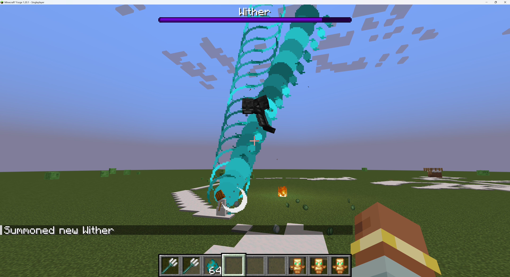

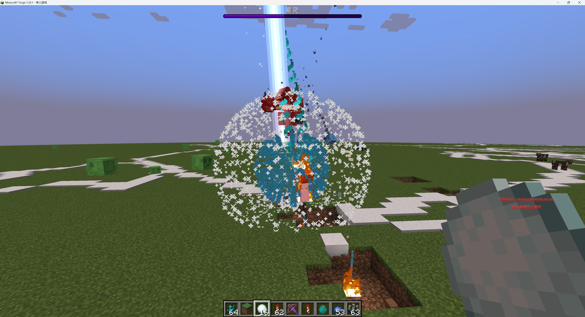

## 兼容信息

| 模组版本 | Minecraft | 加载器 | Java | 版本特有内容 |
| --- | --- | --- | --- | --- |
| 1.0.0 | 1.20.1 | Forge 47.4.10 | 17 | - |
| 1.0.0 | 1.21.1 | NeoForge 21.1.235 | 21 | 风弹插件 |

- 运行端：客户端与服务端；多人游戏时两端都要安装。
- 依赖mod：无
- 模组 ID：`super_snowmen`
- 许可证：[MIT](LICENSE)
- 问题反馈：[GitHub Issues](https://github.com/LostPatrol/SuperSnowmen/issues)

## 玩法

1. 按原版方式建造雪傀儡，然后右键雪傀儡打开升级界面。
2. 在 3 个基础槽、20 个发射物插件槽和 3 个特殊槽内放入有效物品。点击 `?` 按钮可查看插件指南，悬停 `i` 按钮可查看当前效果。
3. Shift + 右键雪傀儡可一次取回全部升级。背包放不下的物品会安全掉落。
4. 手持雪球右键受伤的雪傀儡可恢复 10 点生命。非创造模式消耗 1 个雪球；满血时不会消耗。

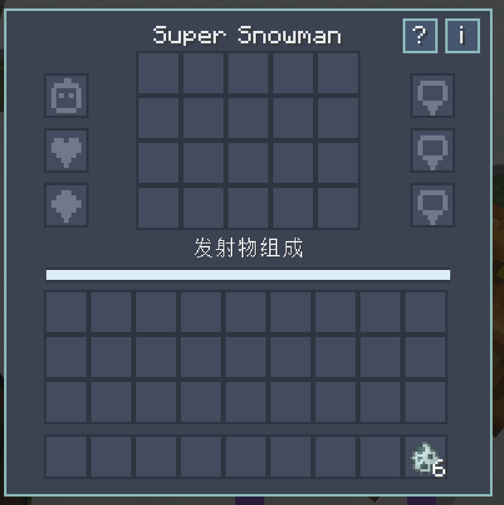

雪傀儡死亡时，所有升级正常掉落。雪傀儡拥有的攻击不会伤害玩家或其他雪傀儡，爆炸、有害药水效果和引雷产生的闪电也在保护范围内。

## 升级界面与概率

中央区域有 20 个插件槽，每个槽提供 5% 的替换概率；空槽对应发射雪球。除弓、弩和避雷针最多只能安装一个外，重复插件会让对应发射物的占比以 5% 为单位累加。

界面中的发射物组成条会在处理联动后显示真实概率。每个插件槽最多放 1 件物品；被选中的物品是否消耗由下文的服务端配置决定。

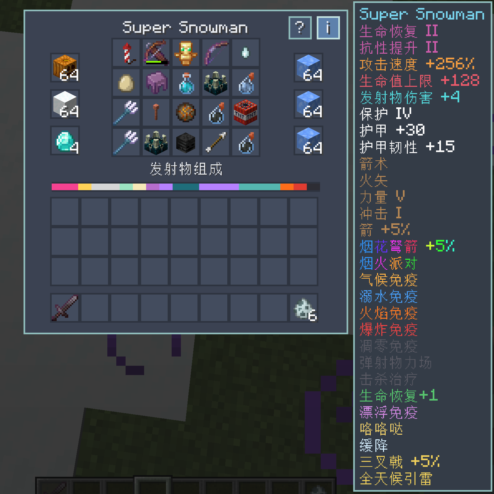

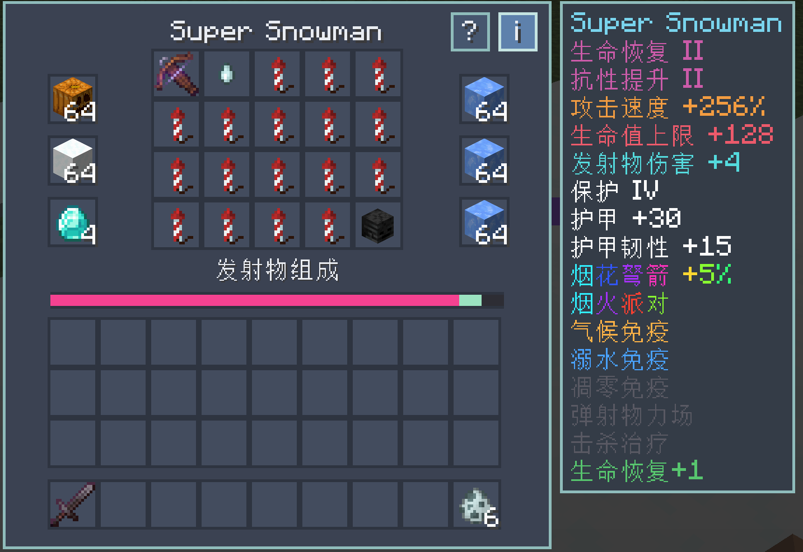

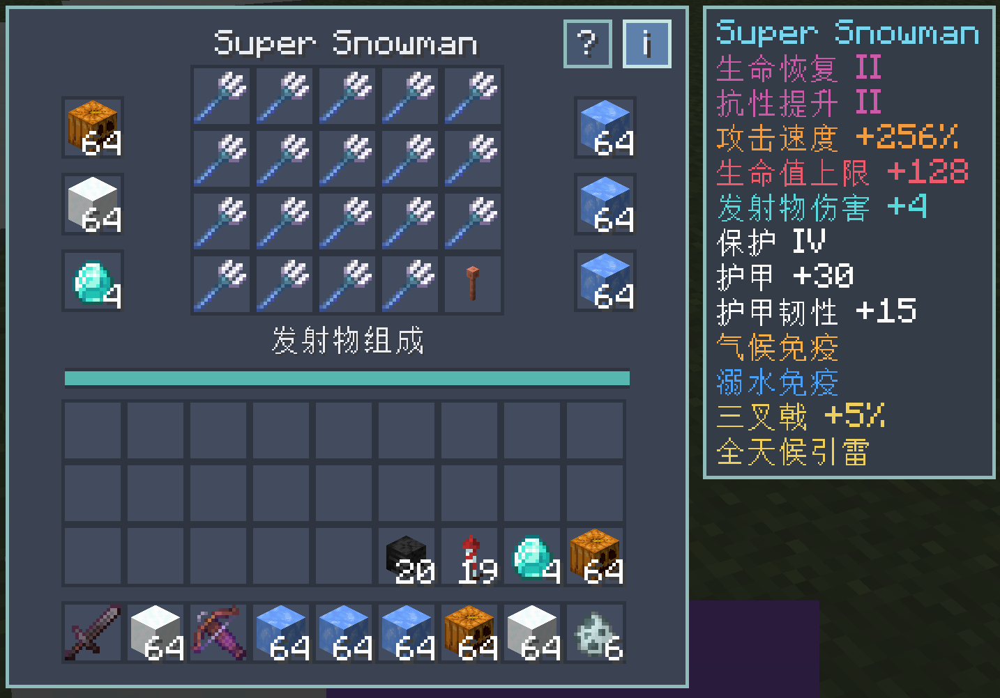

## 基础升级

| 物品 | 槽位上限 | 效果 |
| --- | ---: | --- |
|  南瓜或雕刻南瓜 | 64 | 每个南瓜增加 4% 攻击速度。 |
|  雪块 | 64 | 每个雪块增加 2 点最大生命。 |
|  钻石 | 4 | 每颗钻石增加 1 点原始攻击伤害，并提供相当于 1 级保护的伤害减免 |

## 特殊升级

3 个特殊槽都只有在放满 64 个物品时才会激活。每个槽独立计算，即使放入相同冰块，护甲、韧性也会叠加。

| 物品 | 每个满组提供的效果 |
| --- | --- |
|  冰 | 气候免疫、+5 护甲。气候免疫会阻止环境热伤害，不抗火。 |
|  浮冰 | 气候免疫、溺水免疫、+10 护甲。 |
|  蓝冰 | 气候免疫、溺水免疫、+15 护甲、+5 护甲韧性。 |

原版的有效护甲上限仍然生效, 可搭配其他mod解除护甲上限使用。

## 发射物插件

| 插件 | 发射物与常驻效果 |
| --- | --- |
|  **箭** | 发射原版箭。 |
|  **光灵箭** | 发射光灵箭。 |
|  **火焰弹** | 发射小火球；安装期间持续获得抗火 I。 |
|  **恶魂之泪** | 发射不会破坏方块的大火球；同时让雪傀儡当前的生命恢复效果提高 1 级，多颗恶魂之泪不会重复叠加。 |
|  **烟花火箭** | 发射烟花弩箭， 3 个爆炸条目，随机形状、颜色、特殊效果。 |
|  **龙息** | 发射龙息弹；同时免疫龙息伤害。 |
|  **TNT** | 发射不会破坏方块的TNT，同时免疫普通爆炸伤害。 |
| 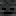 **凋灵骷髅头颅** | 发射凋灵之首，免疫凋零效果；凋零持续时间按原版难度决定。击杀目标时恢复 5 点生命。生命低于一半时像凋灵一样获得免疫弹射物的力场。 |
|  **幽匿尖啸体** | 发出固定 10 点伤害、无视护甲/保护、必定命中的音波尖啸；并伤害沿途的其他怪物 |
| 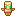 **不死图腾** | 施放一道唤魔尖牙。 |
|  **任意药箭** | 发射药水箭。 |
| 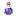 **任意普通药水** | 雪傀儡喝下药水并获得其效果。 |
| 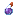 **任意喷溅药水** | 投掷喷溅药水，不会影响玩家。 |
| 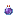 **任意滞留药水** | 投掷滞留药水并生成效果云，不会影响玩家。 |
|  **鸡蛋** | 投掷鸡蛋、持续获得缓降，并像鸡一样下蛋。 |
|  **三叉戟** | 投掷三叉戟；保留穿刺与引雷，移除忠诚与激流。 |
|  **潜影壳** | 发射潜影贝飞弹；提供 +20 护甲（不可叠加），并免疫漂浮。 |
|  **避雷针** | 联动插件，最多安装一个。单独安装时不提供发射物概率；存在任意三叉戟时提供5% 三叉戟概率，并使得三叉戟能够无视天气条件触发引雷。 |
| 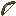 **弓** | 联动插件，最多安装一个。提供额外 5% 箭；降低箭矢发射物的散布、所有普通箭、光灵箭和药箭都会使用满弓速度，并继承力量、冲击和火矢。不会损失耐久。 |
| 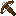 **弩** | 联动插件，最多安装一个。单独安装时不提供发射物概率；存在烟花火箭时提供 5% 烟花弩箭。多重射击附魔将一次发射 3 枚相同烟花，最多只消耗 1 枚被选中的烟花；不会损失耐久。 |
|  **风弹** | 朝目标发射风弹（仅 Minecraft 1.21.1） |

### 套装效果

- 填满全部 20 个插件槽会持续获得生命恢复 I 和抗性提升 I。
- 在填满 20 个插件槽的基础上，再激活全部 6 个属性槽，两种效果都会升级为 II 级。3 个基础槽必须非空，3 个特殊槽都必须放满有效物品。
- 恶魂之泪可以使现有生命恢复效果增加 1 级。

## 其他规则

- **友军保护：**雪傀儡拥有的攻击不能伤害玩家或其他雪傀儡；爆炸也不会对他们造成击退，有害效果不会施加给友方雪傀儡。
- **无敌帧：**可配置决定雪傀儡的投掷物攻击是否无视敌人的无敌帧；不会影响滞留药水的效果云和龙息雾

## 服务端配置

服务端配置按世界保存在 `serverconfig/super_snowmen-server.toml`。也可通过游戏内指令修改。

| 配置键 | 默认值 | 作用 |
| --- | :---: | --- |
| `enableUpgrades` | `true` | 启用升级 GUI、取回/雪球治疗交互和发射物替换。关闭后不会自动拆除已安装升级；物品移除前，已有升级的被动属性和效果仍会生效。 |
| `consumeProjectileItems` | `false` | 升级插件是否消耗。此项为 `true` 时，药水类也会被消耗，不受药水专用开关关闭的影响。 |
| `consumePotionProjectiles` | `true` | 额外控制药箭、普通药水、喷溅药水和滞留药水的消耗 |
| `bypassDamageCooldown` | `true` | 让雪傀儡的攻击绕过非玩家目标的原版受伤冷却。 |

## 指令

全部指令都需要 2 级权限，参数接受 `true` 或 `false`。

| 指令 | 作用 |
| --- | --- |
| `/supersnowmen enable <布尔值>` | 设置 `enableUpgrades`。 |
| `/supersnowmen consumeProjectiles <布尔值>` | 设置 `consumeProjectileItems`。 |
| `/supersnowmen consumePotionProjectiles <布尔值>` | 设置 `consumePotionProjectiles`。 |
| `/supersnowmen bypassDamageCooldown <布尔值>` | 设置 `bypassDamageCooldown`。 |

## 许可证

Super Snowmen 使用 [MIT 许可证](LICENSE)。
